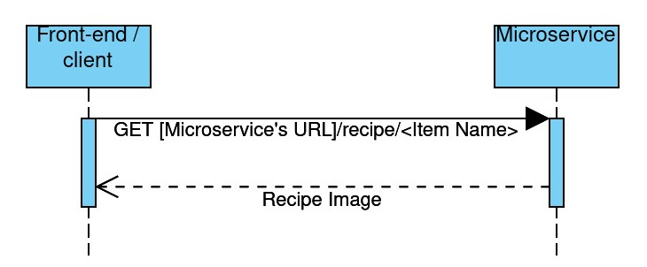

# CS361-Microservice

This is a microservice made for my CS 361 class, it takes an item name from the game Minecraft and returns a image of the recipe for that item.

It returns an image of the first crafting recipe on the wiki page for a given item, whether that be under obtaining or usage.

## Usage:
- Example http request: `GET http://localhost:2000/recipe/enchanting table`
    - In JavaScript: `fetch("http://localhost:2000/recipe/enchanting table");`
- The http request returns content-type `image/jpeg` if successful. If not successful, it returns `text/html` with the return body set to "No recipe found".

### UML Sequence Diagram:

## Running the microservice:
To run on your own server:
1. Ensure you have [Node.js](https://nodejs.org/en/) installed
2. Clone this repository
3. Run `npm install` in a terminal in the repository's directory
4. Run `npm start` to start the microservice
    - Use CTRL+C to stop the microservice

The port used can be changed by editing the value of PORT in `index.js`

